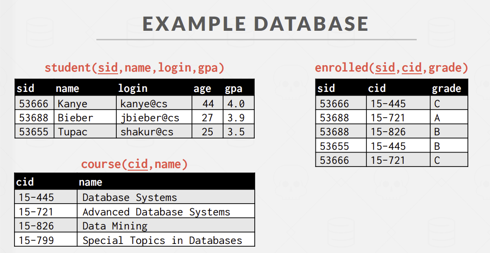

# Introduction to Database Systems

课程地址：[CMU 15-445 Intro to DB Systems](https://www.youtube.com/watch?v=uikbtpVZS2s&list=PLSE8ODhjZXjaKScG3l0nuOiDTTqpfnWFf&index=1)

## Relational Model and Relational Algebra

- 数据库是指某种方式相互关联的数据集合，旨在对现实世界某些东西进行建模。
- 数据库是电脑应用的核心组件。

### 一个简单的示例

音乐 app，储存歌手的信息和专辑的信息。

1. 歌手信息表：

   ```csv
   "GZA",1990,"USA"
   ```

2. 专辑信息表：

   ```csv
   "Liquid Swords","GZA",1990
   ```

```python
for line in file.readlines():
    record=parse(line)
    if record[0] == "GZA":
        print(record[1],record[2])
```

缺点：

1. 线性查找，性能较差。
2. `record[0]`中的 0 是魔法数字。
3. 如果出现无效数据，无从得知。
4. 无法处理负责的歌手与专辑的映射关系。
5. 不同编程语言读取？
6. 线程并发？
7. 如果出现意外崩溃，如何保证安全？

### DBMS

- database management system，数据库管理系统，是用来储存和分析数据的软件系统。
- 通常一个 DBMS 有定义，创建，查询，升级，管理等功能。

常见数据模型：

1. Relational
2. Key/Value
3. Graph
4. Document/Object
5. Wide-Column/Column-Family
6. Array/Matrix/Vectors
7. Hierarchical
8. Network
9. Multi-Value

1 是最普遍的。
2，3，4，5 是 NoSQL 数据库。
6 是基于数组和向量的矩阵，常用于机器学习。
7，8，9 是一些古早的旧模型。

### 关系型数据库

关系型数据库定义了一个抽象层来避免维护开销。

- 用简单的关系型数据结构来储存数据。
- 物理储存由 DBMS 管理，并提供高效的查询和索引功能。
- 用高级语言来访问数据，由 DBMS 提供接口。

1. Structure: 定义数据库的关系和属性。
2. Integrity：确保数据库的内容符合完整性约束。
3. Manipulation：提供插入，删除，更新等操作。

关系是一个无序集合，包含表示实体的属性的关系。
元组是关系中的一组属性值。
值是原子的。
`NULL`是每一个元组的成员。

关系需要一个主键，例如 `id`，用来唯一标识一个元组。

### DML

data manipulation language，数据操纵语言，用来操作数据库中的数据。

Procedural Language(Relational Algebra)：SQL，指定高级策略来操纵数据库，用于定义和操纵关系型数据库。
Non-Procedural Language(Relational Calculus)：NoSQL，仅指定查询的数据而不指定具体的操作，用于定义和操纵非关系型数据库。

七个基础操作：

1. `SELECT`：查询数据。

   ```sql
   SELECT * FROM R
   WHERE a_id='a2' AND b_id>102;
   ```

2. `PROJECT`：选择特定列。

   ```sql
   SELECT a_id, b_id FROM R
   WHERE a_id='a2' AND b_id>102;
   ```

3. `JOIN`：合并两个关系。

   ```sql
   SELECT * FROM R NATURAL JOIN S;
   SELECT * FROM R JOIN S USING (a_id, b_id);
   ```

4. `UNION`：合并两个或多个关系。

   ```sql
   SELECT * FROM R UNION ALL SELECT * FROM S;
   ```

5. `DIFFERENCE`：返回两个关系的差集。

   ```sql
   SELECT * FROM R EXCEPT SELECT * FROM S;
   ```

6. `INTERSECTION`：返回两个关系的交集。

   ```sql
   SELECT * FROM R INTERSECT SELECT * FROM S;
   ```

7. `PRODUCT`：返回两个关系的笛卡尔积。

   ```sql
   SELECT * FROM R CROSS JOIN S;
   SELECT * FROM R, S;
   ```

对于查询语句，自己写的 sql 语句，DBMS 会自动优化查询计划。

## Modern SQL

SQL:

1. Data Manipulation Language，数据操纵语言，用来操作数据库中的数据。
2. Data Definition Language，数据定义语言，用来定义数据库的结构。
3. Data Control Language，数据控制语言，用来控制数据库的事务。

Also includes:

- View definition
- Integrity & Referential Constraints
- Transactions

Important:
是基于 bags(duplicates)而不是 sets(no duplicates)的关系模型。



### Aggregates

- `AVG(col)`：求平均值。
- `MIN(col)`：求最小值。
- `MAX(col)`：求最大值。
- `SUM(col)`：求和。
- `COUNT(col)`：计数。

例子 1：

> Get # of students with a "@cs" login:
>
> ```sql
> SELECT COUNT(login) AS cnt FROM student WHERE login LIKE '%@cs%'
> SELECT COUNT(*) AS cnt FROM student WHERE login LIKE '%@cs%'
> SELECT COUNT(1) AS cnt FROM student WHERE login LIKE '%@cs%'
> ```

例子 2：

> Get the number of students and the average GPA that have a "@cs" login:
>
> ```sql
> SELECT AVG(gpa), COUNT(sid) FROM student WHERE login LIKE '%@cs'
> ```

例子 3：

> Get the number of unique students that have an "@cs" login:
>
> ```sql
> SELECT COUNT(DISTINCT login) FROM student WHERE login LIKE '%@cs'
> ```

例子 4：

> Get the average GPA of students enrolled in each course
>
> ```sql
> SELECT AVG(s.gpa), e.cid FROM enrolled AS e, student AS s WHERE e.sid = s.sid GROUP BY e.cid
> ```

### String Operations

- `LIKE`：模糊匹配。
  - `%`：匹配任意字符串（包括空）。
  - `_`：匹配单个字符。
- `||`：连接字符串。

### Date/Time Operations

> Demo: Get the # of days since the beginning of the year.
>
> ```sql
>
> -- get the current date
> -- 1
> SELECT NOW()
>
> -- 2
> SELECT CURRENT_TIMESTAMP();
>
> -- 3
> SELECT CURRENT_TIMESTAMP;
>
> ```

### Output Redirection

- SQL-92:
  `SELECT * FROM table1 INTO table2;`
- MySQL:
  `CREATE TABLE table2 AS SELECT * FROM table1;`

### Output Control

- `ORDER BY [ASC|DESC]`: 排序。
- `LIMIT <count> [offset]`: 限制输出数量。

### Nested Queries

`SELECT name FROM student WHERE sid IN (SELECT sid FROM enrolled)`

```sql
-- 1
SELSECT name
FROM
    student
WHERE
    sid IN (
        SELECT
            sid
        FROM
            enrolled
        WHERE
            cid = '15-445'
    )

--2
SELECT
    name
FROM
    student
WHERE
    sid = ANY(
        SELECT
            sid
        FROM
            enrolled
        WHERE
            cid = '15-445'
    )
```

`ALL`：返回所有满足条件的行。
`ANY`：返回满足条件的行中的任意一行。
`IN`：相当于`ANY`。
`EXISTS`：检查子查询是否有结果。

TODO: 02 - Modern SQL 1:07:15

### Database Storage

- CPU Registers->CPU Caches->DRAM->SSD->HDD->Network Stroage
- 越左边，越小，越快，越贵。
- 以 DRAM 和 SSD 作为分界线，左边是易失性存储，随机访问，字节寻址，右边是持久性存储，顺序访问，块寻址，磁盘寻址。

| time             | Storage         |
| ---------------- | --------------- |
| 1ns              | L1 Cache Ref    |
| 4ns              | L2 Cache Ref    |
| 100ns            | DRAM            |
| 16,000ns         | SSD             |
| 2,000,000ns      | HDD             |
| ~50,000,000ns    | Network Storage |
| 1,000,0000,000ns | Tape Archives   |

非易失的随机访问比顺序访问慢。
因此：

1. 通过算法减少对随机页面的写入。
2. 同时分配多个页面为盘区。

#### 为什么不使用系统 IO？

1. 事务安全。
   OS 可能随时刷新数据。
2. IO Stalls。
   DBMS 不知道哪些数据在内存中。
3. 错误处理。
   难以验证数据是否正确。
4. 性能。
   OS 数据结构，TLB 击落。

对于其中一些问题，有一些解决方案：

- madvise：告诉操作系统您希望如何阅读某些页面。
- mlock：告诉操作系统内存范围无法分页。
- msync：告诉操作系统将内存范围刷新到磁盘。

DBMS（几乎）总是想自己控制事情，并且可以比操作系统做得更好。

- 以正确的顺序将脏页刷新到磁盘。
- 专门的预取。
- 缓冲区更换策略。
- 线程/进程调度。

### File Storage

DBMS 中存在三种不同的“页”概念：

- 硬件页面（通常为 4KB）
- 操作系统页面（通常为 4KB）
- 数据库页 (512B-16KB)

硬件页是存储设备可以保证故障安全写入的最大数据块。

不同的 DBMS 以不同的方式管理磁盘上文件中的页面。

- Heap File Organization
- Tree File Organization
- Sequential / Sorted File Organization (ISAM)
- Hashing File Organization
